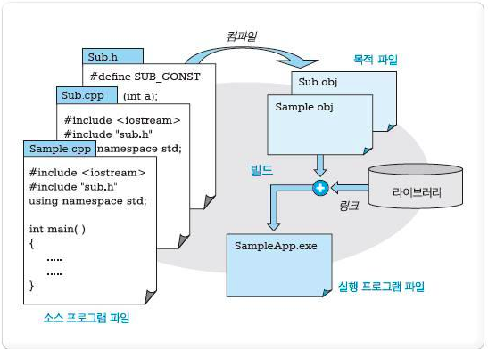

## C++이란

C언어를 확장하여 만든 객체지향 프로그래밍

C언어의 대부분 특징을 포함하고 있어 시스템 프로그래밍에 적합하다.

클래스, 연산자 중복, 가상함수 등과 같은 특징을 가지고 있다.

 

#### C++ 프로그램의 작성 및 빌드

- 소스파일: C++로 작성한 프로그램을 담은 파일, C++ 소스(.cpp, .cxx, .c)와 C++ 헤더 파일(.h)로 이루어짐

- 작성단계

1. 프로그램 작성 (.cpp)

2. 컴파일 (.obj)

3. 링크 (.obj 파일 연결)

4. 실행 파일 (.exe)

5. 실행

 

## JAVA란

https://helloworld-88.tistory.com/3

C/C++ 스타일의 언어와 가상 머신을 구현한 것으로, **Write Once, Run Anywhere**을 목표로 작성된 객체지향 프로그래밍

 

#### JAVA 특징

1. 객체지향 언어

- 캡슐화, 상속성, 다형성 지원

2. 높은 이식성

- 자바 실행 환경(JRE)이 설치된 모든 운영체제에서 실행 가능

3. 컴파일 언어 + 인터프리터 언어

- .java 컴파일하여 바이트 코드로 컴파일로 만든 후, 자바 Runtime이 클래스 파일을 인터프리트하면서 실행

3. 메모리를 자동으로 관리

- 가비지 컬렉션

- 객체 생성시 자동으로 메모리 영역을 찾아서 할당하고, 사용이 완료되면 자동으로 사용하지 않는 객체 제거

- 개발자가 메모리 관리의 수고를 덜어 핵심 기능 코딩에 집중할 수 있음

4. 멀티 스레드 구현이 쉬움

- 스레드 생성 및 제어와 관련된 라이브러리 API 제공 -> 운영체제에 상관없이 멀티 스레드 구현

5. 동적 로딩 지원

- 필요한 시점에 클래스를 로딩

- 비교적 적은 작업으로 처리할 수 있는 유연한 애플리케이션 장성

6. 분산 환경 지원

- TCP/IP 라이브러리가 기본적으로 포함됨

- HTTP, HTP 프로토콜을 기본적으로 지원

7. 오픈소스 라이브러리가 풍부

- 자바는 오픈소스 언어

- 라이브러리 또한 오픈소스의 양이 방대

- 유지보수를 쉽고 빠르게 진행

 

## C++과 Java의 차이점

|                 | C++                                                          | Java                                                         |
| --------------- | ------------------------------------------------------------ | ------------------------------------------------------------ |
| 특징            | 플랫폼 종속적 언어 모든 플랫폼에서 컴파일                    | 플랫폼 독립적 언어 바이트 코드로 컴파일 ▶ 모든 플랫폼 실행   |
| 컴파일러        | 컴파일러 > 실행 가능한 객체 코드로 컴파일                    | 컴파일러 + 인터프리터 > 컴파일 후 바이트 코드 해석           |
| 과정            | 소스파일(컴파일) ▶ 목적파일(링크) ▶ 실행파일                 | 소스파일(컴파일) ▶ 클래스파일(JVM) ▶ 실행파일                |
| 바인딩          | 정적바인딩                                                   | 동적바인딩                                                   |
| 문법            | 프로그래머에 의해 메모리 관리 제어 기능                      | 가비지 컬렉션                                                |
| 연산자 오버로딩 | O                                                            | X                                                            |
| 다중 상속       | O                                                            | X 인스턴스로 비슷하게 사용 가능                              |
| 추상 클래스     | 순수 가상 함수들을 가진 클래스(0으로 초기화)                 | 반드시 파생되어야 함 자신은 인스턴스화 될 수 없음            |
| 형변환          | 기본 자료형, 사용자 정의 자료형에 대한 암시적 형변환 허용    | 기본 자료형 사이에 오직 넓은 범위로의 암시적 형변환 허용 그 외: CAST를 통한 명시적 형변환만 가능 |
| 장점            | 값에 의한 전달 참조에 의한 전달 포인터 전달을 통한 데이터 전달 속도가 빠름 | 웹에 최적화 C++에 기반하지만 규모가 작고, 단순 높은 신뢰성 및 유지보수 편리 |
| 단점            | 객체지향 개념이 약함                                         | C++에 비해 속도가 느림 단일 상속 포인터X 바이트 코드 보안 취약 |