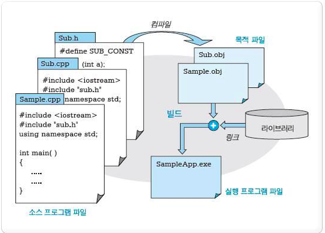

## 데이터베이스(DataBase)란?

통합하여 관리되는 **데이터**의 집합체

중복된 데이터 최소화, 자료 구조화, 효율적인 처리를 할 수 있도록 관리

 

### 데이터베이스 정의 및 특징

**정의**

- 통합된 데이터(Integrated Data): 자료의 중복을 배제한 데이터 모임

- 저장된 데이터(Stored Data): 컴퓨터가 접근할 수 있는 저장 매체에 저장된 자료

- 운영 데이터(Operational Data): 조직의 고유한 업무를 수행하는 데 존재 가치가 확실하고 없어서는 안되는 **반드시 필요한 자료**

- 공용 데이터(Shared Data): 여러 응용 시스템들이 공동으로 소유하고 유지하는 자료

 

**특징**

- 실시간 접근성: 수시적이고 비정형적인 질의에 대해 실시간 처리에 의한 응답 가능

- 계속적인 변화: 데이터베이스의 상태는 동적 -> 새로운 데이터의 삽입, 삭제, 갱신으로 **항상 최신 데이터 유지**

- 동시공용: 다수의 사용자가 동시에 같은 내용의 데이터 이용

- 내용에 의한 참조: 데이터베이스에 있는 데이터를 참조할 때 데이터 레코드의 주소나 위치에 의해서가 아니라, 사용자가 요구하는 **데이터 내용**으로 데이터를 찾음

- 데이터 독립성: 응용 프로그램과 데이터베이스를 독립, 데이터의 논리적 구조를 변경시켜도 응용 프로그램은 변경X

 

### 데이터베이스 관리 시스템(DBMS, DataBase Management System)

다수의 사용자들이 데이터베이스 내의 데이터에 접근할 수 있도록 하는 **소프트웨어**

- 기존 파일 시스템이 갖는 데이터의 종속성과 중복성의 문제를 해결하기 위해 제안된 시스템

- 데이터베이스의 구성, 접근방법, 유지관리에 대한 모든 책임을 가짐

 

### 데이터베이스 용어 정리

https://1-day-1-coding.tistory.com/2

- 관계형 데이터베이스(RDB): 여러개의 테이블이 특정 관계로 이루어져있는 구조를 가진 데이터베이스

- NoSQL(Not Only SQL): 데이터-테이블간의 관계를 정의하지 않는 데이터베이스, 스키마가 없음

- 엔티티(Entity): 사람, 장소, 사물, 사건 등 독립적으로 존재하면서 **고유하게 식별**이 가능한 실세계의 객체

- 엔티티 집합(Entity Set): 동일한 속성을 가진 엔티티들의 집합

- **스키마(Schema)**: 데이터베이스의 구조를 전반적으로 기술한 것

◽ 스키마 구성: 개체(Entity), 속성(Attribute), 관계(Relationship)

◽ 스키마 종류 ▶ DBMS는 외부 스키마에 명세된 사용자의 요구를 개념 스키마 -> 내부 스키마로 변환

- 외부스키마(사용자 뷰): 사용자 입장에서 정의한 데이터베이스의 논리적 구조
  - 데이터들을 어떤 형식, 구조, 화면을 통해 사용자에게 보여줄 것인지에 대한 명세
  - 여러개의 외부 스키마 존재 가능
  - SQL, C, Java 등을 이용해 DB에 접근
- 개념스키마(전체적인 뷰): 데이터베이스의 전체적인 논리적 구조
  - 모든 이용자가 필요로하는 데이터를 총합한 조직 전체의 데이터베이스 ▶ 단 한개만 존재
  - 개체 간의 관계, 제약조건, 접근 권한, 보안 등 명세를 나타냄
  - 데이터베이스 관리자에 의해 구성
- 내부스키마: 물리적 저장장치의 입장에서 본 데이터베이스 구조
  - 레코드의 물리적 구조, 저장 데이터 항목의 표현 방법, 내부 레코드의 물리적 순서 등

 

- **표(Table)**

 

◽ Relation(= Table): 관계형 데이터베이스에서 정보를 구분하여 저장하는 기본 단위

◽ Tuple(= Record): 테이블의 행을 의미. 튜플은 릴레이션에서 같은 값을 가질 수 없다.

◽ 카디날리티(Cardinality): 튜플의 수

◽ Attribute(= Field): 테이블의 열을 의미. Attribute의 수는 Degree라고도 함

◽ 식별자(idnetifier): 여러 개의 집합체를 담고 있는 관계형 데이터베이스에서 각각 구분할 수 있는 논리적 개념

- 유일성: 하나의 릴레이션에서 모든 행은 서로 다른 키 값을 가져야 함
- 최소성: 꼭 필요한 최소한의 속성들로만 키를 구성

 

 

 - **Key**

데이터베이스에서 조건에 만족하는 튜플을 찾거나 정렬할 때, 튜플들을 서로 구분할 수 있는 기준이 되는 Attribute

◽ 후보키(Cardidate Key)

- 속성들 중 튜플을 유일하게 식별하기 위해 사용하는 속성들의 부분집합
- 기본 키로 사용할 수 있는 속성들
- 모든 릴레이션은 반드시 하나 이상의 후보키 존재
- 유일성과 최소성 만족

◽ 기본키(Primary Key)

- 후보키 중에서 선택한 메인키
- 한 릴레이션에서 특정 튜플을 유일하게 구별할 수 있는 속성
- null값을 가질 수 있음
- 동일한 값 중복 저장X

◽ 슈퍼키(Super Key)

- 한 릴레이션 내에 있는 속성들의 집합으로 구성된 키
- 릴레이션을 구성하는 모든 튜플들 중 슈퍼키로 구성된 속성의 집합과 동일한 값을 나타내지 않음
- 릴레이션을 구성하는 모든 튜플에 대해 유일성을 만족하지만 최소성을 만족하지 않음

◽ 외래키(Foregin Key)

어떤 릴레이션간의 기본키를 참조하는 속성, 테이블 간의 관계를 나타냄

- 다른 릴레이션의 기본 키를 그대로 참조하는 속성의 집합
- 외래키가 되는 속성과 기본키가 되는 속성의 이름은 달라도 됨 -> 도메인은 반드시 같아야 함
- null 값을 가질 수 있음
- 참조할 수 없는 값을 가질 수 없음

 

### SQL(Structured Query Language)

데이터베이스에서 데이터를 정의, 조작, 제어하기 위해 사용하는 언어

#### 종류

1. DDL(Data Definition Language): 데이터베이스나 테이블을 **생성, 삭제 또는 구조를 변경**하는 명령어

2. DML(Data Manipulation Lanaguage): 데이터베이스에 저장된 데이터를 **처리, 조회, 검색**하는 명령어

3. DCL(Data Control Language): 데이터베이스에 저장된 데이터를 관리하기 위해 **데이터의 보안성 및 무결성** 등을 제어하는 명령어