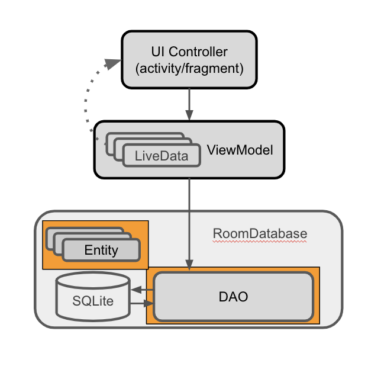

# Create a Room Database

### Database

* Entity
  * **An object or a concept** along with its properties, to store in the database.
  * An entity class defines a table, and each instance of that class represents a row in that table.
* Query
  * A request for data or information from a database table or combination of tables, or a request to perform an action on the data.
  * CRUD

* Use case: Displaying cached data, which enables people to use your app while in offline


### Room

* Facilitates us to create entity in the SQLite tables and declare functions to query.
* You must define each entity as an **annotated data class** , and the interactions with those entities as an **annotated interface**, called *DAO (Data Access Object)*.



### Codelab - Example of Entity using data class

```kotlin
@Entity(tableName = "daily_sleep_quality_table")
data class SleepNight(
    @PrimaryKey(autoGenerate = true)
    var nightId: Long = 0L,
 
    @ColumnInfo(name = "start_time_milli")
    val startTimeMilli: Long = System.currentTimeMillis(),

    @ColumnInfo(name = "end_time_milli")
    var endTimeMilli: Long = startTimeMilli,

    @ColumnInfo(name = "quality_rating")
    var sleepQuality: Int = -1
)
```

### Codelab - Example of creating DAO

* By defining and calling Kotlin function in your code, these Kotlin functions map to SQL Queries.
* You can declare these functions in the *DAO* interface, and automatically Room creates the necessary code in compile time.
* CRUD actions are done by annotating with  `@Insert`,  `@Delete`, and `@Update`. For everything else, we can use `@Query`. 

```kotlin
@Dao
interface SleepDatabaseDao {
    @Insert
    fun insert(night: SleepNight)
  
    @Update
    fun update(night: SleepNight)
  
    @Query("SELECT * from daily_sleep_quality_table WHERE nightId = :key")
    fun get(key: Long): SleepNight?
  
    // We can use @Delete as well as @Query, but it is only applicable when you want to delete specific entries.
    @Query("DELETE FROM daily_sleep_quality_table")
    fun clear()
	
    @Query("SELECT * FROM daily_sleep_quality_table ORDER BY nightId DESC LIMIT 1")
    fun getTonight(): SleepNight?
  
    @Query("SELECT * FROM daily_sleep_quality_table ORDER BY nightId DESC")
    fun getAllNights(): LiveData<List<SleepNight>>
}
```

### Codelab - Create and test a Room database

* Create database holder (abstract class subclassing `RoomDataBase` ).
* Annotate with `@Database`, with entities for the database and set the version number.
* Define an abstract method or property that returns DAO. The body will be generated by `Room`  in compile time.
* Make the `RoomDatabase` **singleton** to have unique instance for the whole app.
* Use `Room`'s database builder to create the database only if the database doesn't exist.

```kotlin
// When exportSchema is set to false, this won't keep schema version history backups.
@Database(entities = [SleepNight::class], version = 1, exportSchema = false)
abstract class SleepDatabase : RoomDatabase() {
    abstract val sleepDatabaseDao: SleepDatabaseDao
    
    companion object {
        // never be cached, and all R/W will be done from and to the main memory.
        // You can make sure the value of INSTANCE is always up-to-date and the same to all execution threads.
        @Volatile
      	private var INSTANCE: SleepDatabase? = null // singleton

      	fun getInstance(context: Context): SleepDatabase {
            // Thread synchronization, means only one thread of execution at a time can enter this block of code. 
            synchronized(this) {
	        var instance = INSTANCE
            	if (instance == null) {
    		    instance = Room.databaseBuilder(
				  context.applicationContext,
				  SleepDatabase::class.java,
				  "sleep_history_database"
				)
                    .fallbackToDestructiveMigration()
                    .build()
              	    INSTANCE = instance
            	}
            	return instance
            }
      	}
    }
}
```


> *Annotate `INSTANCE` with `@Volatile`. The value of a volatile variable will never be cached, and all writes and reads will be done to and from the main memory. This helps make sure the value of `INSTANCE` is always up-to-date and the same to all execution threads. It means that changes made by one thread to `INSTANCE` are visible to all other threads immediately, and you don't get a situation where, say, two threads each update the same entity in a cache, which would create a problem.*


```kotlin
@RunWith(AndroidJUnit4::class)
class SleepDatabaseTest {
    private lateinit var sleepDao: SleepDatabaseDao
    private lateinit var db: SleepDatabase

    @Before
    fun createDb() {
        val context = InstrumentationRegistry.getInstrumentation().targetContext
        // Using an in-memory database because the information stored here disappears when the
        // process is killed.
        db = Room.inMemoryDatabaseBuilder(context, SleepDatabase::class.java)
                // Allowing main thread queries, just for testing.
                .allowMainThreadQueries()
                .build()
        sleepDao = db.sleepDatabaseDao
    }

    @After
    @Throws(IOException::class)
    fun closeDb() {
        db.close()
    }

    @Test
    @Throws(Exception::class)
    fun insertAndGetNight() {
        val night = SleepNight()
        sleepDao.insert(night)
        val tonight = sleepDao.getTonight()
        assertEquals(tonight?.sleepQuality, -1)
    }
}
```

